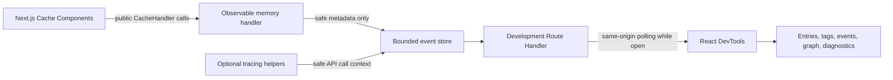

# Architecture

## Event collection

`withCacheLens` configures one in-memory handler module for the `default` and `remote` Cache Components handler names. The handler implements the documented `get`, `set`, `refreshTags`, `getExpiration`, and `updateTags` methods. It clones opaque `ReadableStream` values only to meet the cache storage contract; event records never receive stream chunks or cached values.

The handler uses stable SHA-256-derived identifiers truncated to 64 bits for display. Raw cache keys never enter event metadata.

## Cache behavior

The handler is an LRU-like insertion-ordered map bounded to 500 entries and 50 MiB. It waits for pending sets, clones streams on reads, honors entry revalidation/expiration metadata, and tracks stale versus immediately expired tag timestamps. The store is process-local, matching the development-first scope.

## Event store

Events live in an O(1) ring buffer with a default capacity of 1,000. Entry and tag indexes are updated as events arrive. Snapshots include complete aggregate state and optionally only events after a cursor, preventing the client from downloading the entire history each time.

Diagnostics use fixed, documented thresholds and collected evidence. No model or intent inference is involved.

## Server boundary

The Route Handler is disabled outside development. Responses are `no-store` and `nosniff`. Mutation bodies are JSON-only and limited to 4 KiB. Tags must be 1-256 characters without control characters. Cross-site browser mutations are rejected.

## Client boundary

The DevTools subpath is a separate `use client` bundle. It imports only React and public types; Node built-ins, the handler, event store, and Next.js server functions are absent. React is a peer dependency and excluded from the bundle.

For version 0.1.0, `pnpm size` measures 25,645 bytes minified and 7,434 bytes with gzip, excluding peer React.

## Failure isolation

Invalid configuration that could change cache semantics fails clearly. Observation and polling errors surface in the panel. Native Next.js tracing errors propagate unchanged. The handler records cache-fill failures before rethrowing them.
